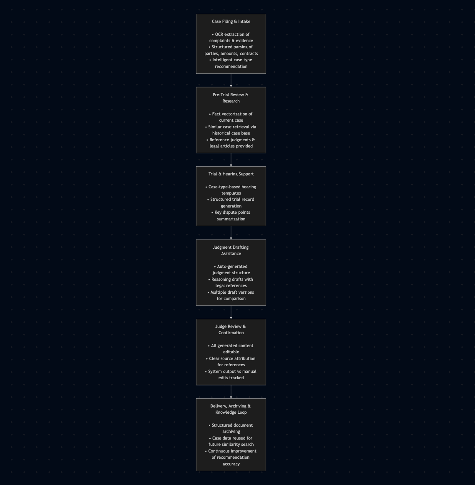
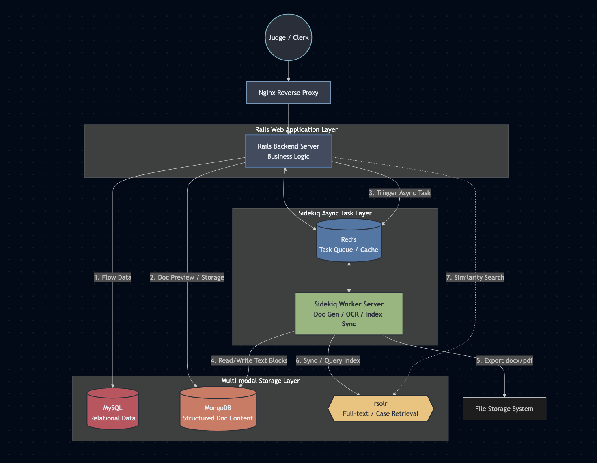

# Court Case Management System (Judicial Platform)

**Company:** Beijing Jingyu Network Technology (Judicial Systems)  
**Role:** Senior Ruby on Rails Developer  
**Period:** Nov 2017 – Oct 2018  
**Domain:** Judicial Informatization / Court Case Processing Systems  

---

## 1. Project Summary

The Court Case Management System is a **judicial case-handling platform** designed to digitize, automate, and optimize the entire lifecycle of court proceedings.

The system significantly reduced manual workload for court staff by:

- Automating document ingestion and structuring
- Digitizing case filing and trial preparation workflows
- Assisting judges in legal research, judgment drafting, and case review
- Enabling knowledge reuse through structured archival <!-- and  feedback loops -->

<!-- The platform adopted a **human-in-the-loop design**, ensuring that automation enhanced judicial efficiency without compromising legal authority or decision accountability. -->

---
??? note "Project Flow: Intelligent Judicial Assistance System"

    ### 2.1 Case Filing
    **Traditional Workflow**

    - Plaintiffs submit complaints, identity documents, and evidence (PDFs, scans, images).
    - Filing clerks manually enter case details (category, parties, amounts).

    **Pain Points**

    - Inconsistent formats and high-volume repetitive data entry.

    **System Solution**
    
    - **OCR & Structured Parsing**: Extract text and identify key entities (Plaintiff, Monetary amounts, etc.).
    - **Intelligent Recommendation**: Based on historical data.

    ---

    ### 2.2 Pre-trial Review
    **Traditional Workflow**

    - Judges manually search laws and similar cases based on personal experience.

    **Pain Points**

    - Time-consuming and inconsistent document review.

    **System Solution**

    - **Automatic Similar Case Retrieval**: Vectorize key facts to find the Top 5 similar historical cases.
    <!-- - **System Output**: Annotated cases with judgment results and legal reasoning. -->

    ---

    ### 2.3 Trial & Hearing
    **Traditional Workflow**

    - Manual note-taking and high effort in organizing Trial records.

    **System Solution**

    - **Template-Based Hearings**: Predefined question templates by case type.
    <!-- - **Structured Records**: Auto-categorized into Fact confirmation and Judicial summaries. -->

    ---

    ### 2.4 Judgment Drafting
    **Traditional Workflow**

    - Even simple cases take 1–2 hours for drafting and legal research.

    **System Solution**

    - **Automated Draft Generation**: Combines current facts with patterns from similar judgments.
    - **Key Design Principle**: System provides reference versions only; **no auto-generated final verdicts**.

    ---

    ### 2.5 Judge Review & Confirmation (Human-in-the-loop)

    - **Full Control**: All system-generated content is fully editable and traceable.
    - **Auditability**: Records machine-generated vs. judge-modified content for legal accountability.

    ---

    ### 2.6 Delivery & Knowledge Feedback
    
    - **Archiving**: Final judgments are automatically stored in structured form.
    <!-- - **Feedback Loop**: Archived cases improve future recommendation accuracy. -->

---

## 3. System Architecture

### Core Technology Stack

- **Backend:** Ruby on Rails (Full-stack)
- **Web Server:** Nginx (Reverse Proxy)
- **Relational Database:** MySQL (Case metadata, parties, workflow states)
- **Document Storage:** MongoDB (Structured legal documents)
- **Search & Similarity Engine:** Apache Solr
- **Cache & Queue:** Redis
- **Async Processing:** Sidekiq
- **Deployment:** On-Site court environment

### Architecture Characteristics

- Nginx routes requests to Rails backend
- Sidekiq handles heavy background jobs:
  - OCR processing
  - Document structuring
  - Similar case indexing
- MongoDB stores structured document data
- Solr supports full-text search and similarity matching
- Redis used for caching and job queues

---

## 4. Technical Challenges & Solutions

### Large-Scale Document Processing
**Challenge**

- Courts process massive volumes of unstructured legal documents daily.

**Solution**

- OCR + background processing via Sidekiq
- Document parsing decoupled from request lifecycle

---

### Legal Similarity Search
**Challenge**

- Efficiently finding legally relevant similar cases.

**Solution**

- Hybrid approach:
  - Text vectorization
  - Rule-based constraints (case type, amount)
- Solr optimized for legal text search and ranking

---

### Judicial Reliability & Trust
**Challenge**

- Automation must not override judicial authority.

**Solution**

- Human-in-the-loop workflow
- Full editability and source traceability
- No automated verdict generation

---

## 5. My Responsibilities & Achievements

### Responsibilities

- Led **on-site requirement analysis** with court staff
- Translated judicial workflows into technical designs
- Oversaw system deployment within court environments
- Managed requirement changes and iteration cycles
- Coordinated developers, stakeholders, and court officials

### Key Achievements

- Led end-to-end project delivery across multiple court deployments, ensuring on-time launch and stable operation in on-premise judicial environments
- Drove requirement analysis and process modeling by working closely with judges and court staff, translating legal workflows into actionable system designs
- Coordinated cross-functional teams (backend, frontend, QA, deployment) to deliver iterative releases aligned with contract and regulatory requirements
- Established effective communication and delivery mechanisms between legal stakeholders and engineering teams, reducing requirement ambiguity and rework
- Built and managed the development team, overseeing task breakdown, progress tracking, and delivery quality throughout the project lifecycle

---
