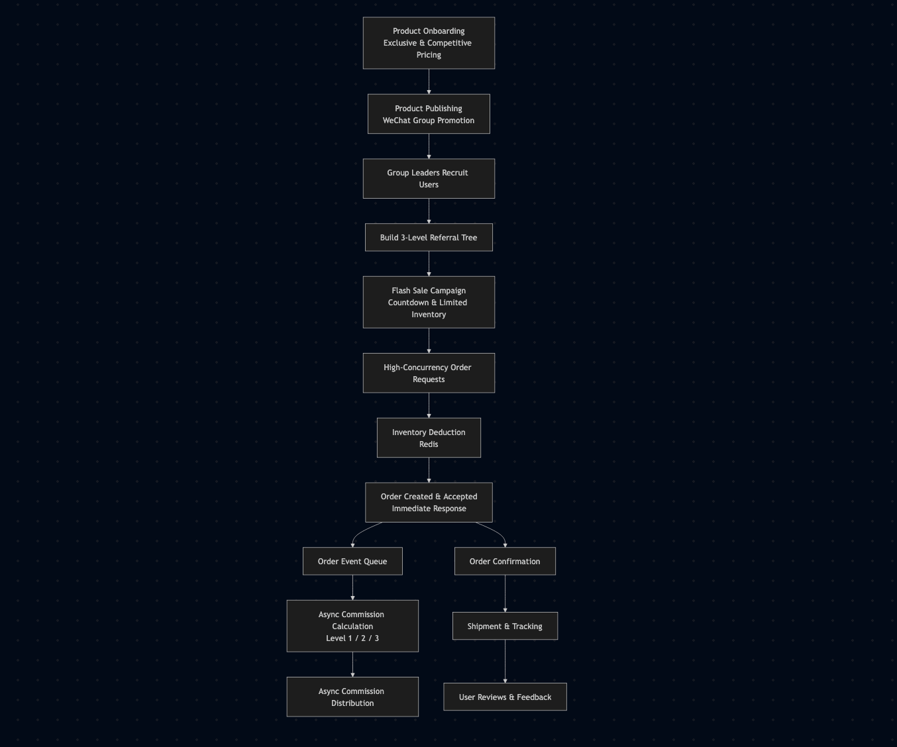
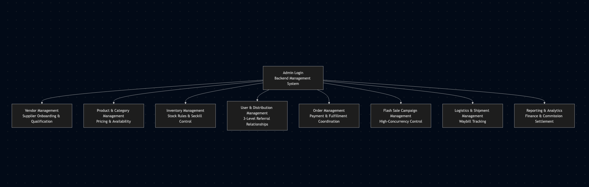
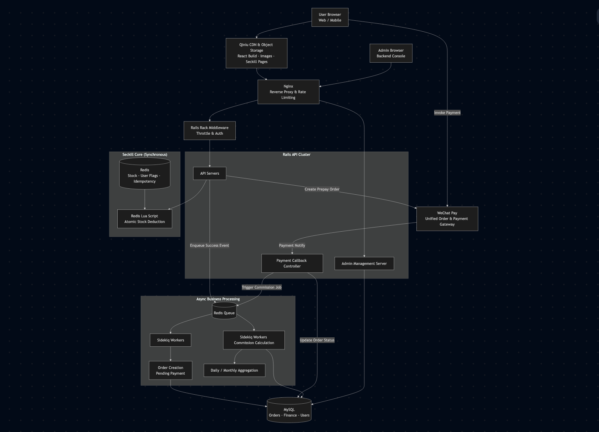

# Distribution E-commerce Platform
*High-Concurrency Flash Sale & E-commerce distribution system*

**Role:** Senior Ruby on Rails Engineer   
**Company:** Guangzhou Lige InfoTech
**Period:** Sep 2015 – Oct 2017 

---

## 1. Project Summary

The **Distribution E-commerce Platform** was a high-concurrency social commerce system focused on **group buying, flash sales, and a three-level referral distribution model**.

The platform leveraged **WeChat-based social networks** as the primary growth and sales channel. Group leaders promoted exclusive, limited-quantity products within private groups, driving highly synchronized purchase behavior during flash sale events.

Each successful order triggered **multi-level commission settlements**, making the system both performance-critical and financially sensitive.

Key Scale Characteristics:

- Sustained **4,000+ QPS peak traffic** during flash sale events with highly synchronized user behavior
- Large-scale order bursts generated within seconds, each triggering **multi-level commission fan-out**
- Extreme write amplification caused by inventory deduction, order creation, and financial settlement
- Real-world backend challenge combining **burst traffic control, inventory consistency, and complex commission calculations**

---

## 2. User & Data Flow

### User Journey (Social Commerce Flow)

1. Platform operators onboard exclusive, competitively priced products.
2. Products are published and promoted via WeChat group channels.
3. Group leaders recruit users and establish multi-level referral relationships.
4. Flash sales are launched with countdown timers and limited inventory.
5. Users place orders simultaneously when the sale opens.
6. Inventory is deducted atomically to prevent overselling.
7. Orders are accepted immediately; heavy processing is deferred.
8. Commission rewards are calculated and distributed across referral levels.
9. Users receive confirmations and track fulfillment.

### Admin & Management Flow (Backend Operations)

Administrators log into the **backend management system** to operate and control the entire business lifecycle.

Key management modules include:

- **Vendor Management**  
  Supplier onboarding, qualification, and product source maintenance.

- **Product & Category Management**  
  Managing product listings, categories, pricing, and availability.

- **Inventory Management**  
  Stock monitoring, inventory deduction rules, and flash sale stock control.

- **User & Distribution Management**  
  Managing users, group leaders, and three-level referral relationships.

- **Order Management**  
  Order lifecycle tracking, payment status, and fulfillment coordination.

- **Flash Sale Campaign Management**  
  Creating, scheduling, and controlling high-concurrency seckill events.

- **Logistics & Shipment Management**  
  Shipment tracking and logistics waybill management.

- **Reporting & Analytics**  
  Operational metrics, financial reports, and commission settlement analysis.

The admin system ensured **full operational visibility and control**, especially during high-risk flash sale campaigns.

---

### Data Flow Characteristics

- **Hot path (synchronous):**  
  Authentication → inventory check → atomic stock deduction → order acceptance

- **Cold path (asynchronous):**  
  Order persistence, commission calculation, balance updates, notifications

---

## 3. System Architecture

### Core Architecture

- **Web Server:** Nginx (reverse proxy & basic rate limiting)
- **Backend:** Ruby on Rails (Puma)
- **Cache & Locking:** Redis
- **Async Processing:** Sidekiq
- **Database:** MySQL
- **Deployment:** Linux-based servers

### Architectural Principles

- Redis acted as the **concurrency gatekeeper**, handling all flash sale inventory logic.
- Rails controllers were intentionally lightweight to survive traffic bursts.
- Sidekiq handled all heavy and non-critical workflows asynchronously.
- Strict separation between request acceptance and financial processing.

<!-- ### Capacity Planning (Peak Scenario)

| Layer        | Configuration | Notes |
|-------------|---------------|-------|
| Rails App   | 7 × 8-core / 32GB | ~650 QPS per node |
| Sidekiq     | 2 × 8-core / 16GB | Concurrency 50 per node |
| Redis       | 1 × 8–16GB | ~12,000 OPS peak |
| MySQL       | 1 primary + 1 replica | ~500 TPS controlled writes | -->

---

## 4. Technical Challenges & Solutions

### High-Concurrency Flash Sales

#### Challenge

During flash sales and promotional events, the platform experienced extreme traffic spikes, with thousands of users attempting to place orders simultaneously.  
Key challenges included:

- Risk of inventory overselling under high concurrency  
- Database overload caused by hot product and stock queries  
- Increased latency due to repeated frontend asset and product data requests  
- Cascading failures across order, payment, and inventory subsystems during peak QPS events  

#### Solution

To ensure system stability, data consistency, and smooth user experience under high load, a multi-layered high-concurrency architecture was implemented:

**Frontend & CDN Optimization**

- Static assets (JavaScript, CSS, images) were served via CDN to reduce application server pressure.
- Product metadata, pricing, and availability flags were preloaded into Redis before flash sales.

**Inventory Control & Atomicity**

- Inventory data was pre-warmed into Redis and treated as the primary source of truth during flash sales.
- Redis were used to perform atomic stock validation and deduction, preventing race conditions and overselling.
- Requests exceeding available stock were rejected at the cache layer to avoid unnecessary backend processing.

**Backend Load Protection**

- Direct database writes were eliminated from the critical purchase path.
- Order creation, payment confirmation, inventory synchronization, and notifications were processed asynchronously using Sidekiq.
- Redis acted as both a cache and a background job queue, smoothing traffic bursts and protecting downstream systems.

**Asynchronous & Event-Driven Processing**

- Payment callbacks, inventory reconciliation, and financial calculations were handled asynchronously.
- Idempotent job execution ensured consistency under retries and partial failures.
- Backend services remained responsive even during peak QPS events.

---

### Three-Level Distribution Commission Logic

**Challenge:** 

Each order triggered multiple dependent financial calculations.

**Solution:**  

- Cached referral relationships in Redis.
- Moved commission calculation entirely to Sidekiq.
- Asynchronous write-back buffering and flattened data indexing.

---

### System Stability Under Traffic Spikes

**Challenge:**  
The legacy system frequently crashed during promotions.

**Solution:**  

- Refactored flash sale and commission modules.
- Introduced async pipelines and strict execution boundaries.
- Applied conservative capacity planning with intentional redundancy.

---

## 5. My Responsibilities & Achievements

### Responsibilities

- Led the refactoring of the flash sale system.
- Designed high-concurrency inventory control mechanisms.
- Optimized the multi-level commission settlement module to handle high-concurrency spikes, increasing system throughput.
- Improved database models and performance.
- Stabilized the platform for large-scale promotional events.

### Key Achievements

- Enabled the system to handle 4,000+ QPS during peak flash sales without downtime.  
- Optimized the entire order and commission processing workflow, reducing server load and improving efficiency.  
- Significantly lowered infrastructure costs through performance tuning and resource optimization.  
- Delivered a robust, scalable, and maintainable system capable of supporting rapid business growth and frequent high-concurrency campaigns.

---
