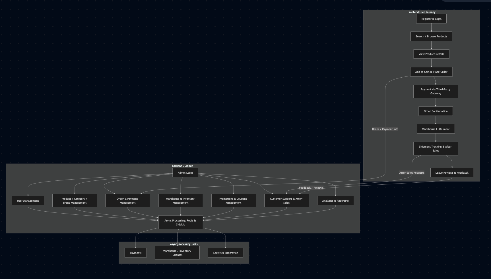
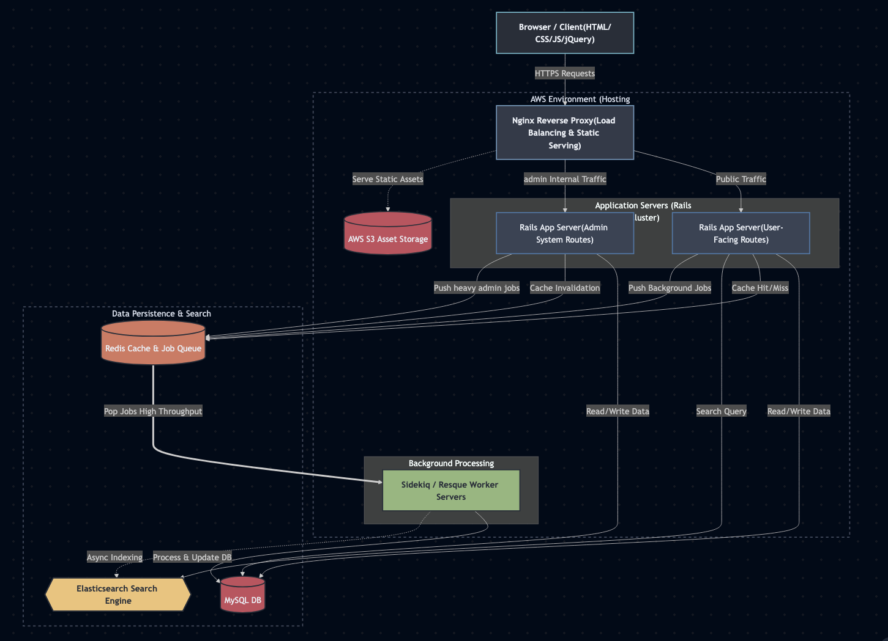

# 🛒 ShopperPlus.ca (E-commerce Platform)

**Role:** Ruby on Rails Engineer   
**Company:** ShopperPlus Canada  
**Period:** Jan 2013 – Sep 2015  
**Website:** [https://www.shopperplus.ca/](https://www.shopperplus.ca/)  

---

## 1. Project Summary

ShopperPlus.ca is a **full-featured e-commerce platform** selling:

- Printers & peripherals  
- Mobile phones, computers, cameras, and accessories  
- Daily consumer goods  

The platform includes a **user-facing online store** and a **comprehensive backend management system** covering:

- **User Management**  
- **Product, Category, and Brand Management**  
- **Order Management**  
- **Payment & Financial Management**  
- **Warehouse & Inventory Management** (Inbound, Outbound, Stock Levels)  
- **Shipping & Logistics Tracking**  
- **After-sales Service & Customer Support**  
- **Promotions, Coupons, and Discount Management**  
- **Reviews, Ratings, and Feedback Management**  
- **Data Analytics & Reporting**  

This backend system supports the **full lifecycle of e-commerce operations**, enabling efficient management of both customers and business processes while ensuring scalability and maintainability.
  

**Key Impact:**

- Built a **scalable and modular e-commerce platform** supporting a full suite of backend operations, including user management, product & category management, order processing, payments, warehouse & inventory management, logistics, promotions, and customer support.  
- Optimized **order fulfillment, payment flows, and inventory synchronization**, enabling seamless handling of high user traffic and large product catalogs.  
- Ensured **high availability, maintainability, and extensibility**, allowing rapid iteration of features and smooth adaptation to evolving business requirements.  
- Implemented **end-to-end monitoring and reporting**, providing actionable insights for business decisions and improving operational efficiency.
  

---

## 2. User & Data Flow

**User Journey (Frontend):**

1. Users register and log in to the platform.  
2. Search for or browse products by category or keyword.  
3. View product details, add items to cart, and place orders.  
4. Complete payment via third-party payment gateway.  
5. Order is confirmed; warehouse handles fulfillment.  
6. Users track shipments, request after-sales support, and leave reviews/feedback.

**Backend Flow (Admin / Management):**

- Administrators manage users, products, categories, brands, orders, payments, warehouse, inventory, promotions, customer support, analytics, and reporting.  
- All heavy integrations (payments, warehouse, logistics) are processed asynchronously.  
- Redis and Sidekiq handle caching, queues, and background jobs for reliable operations.

**Highlights:**

- Clear separation between user-facing and admin-facing flows.  
- Async processing ensures smooth user experience even under high load.  
- Full lifecycle tracking from product listing to after-sales management.  
 

---

## 3. System Architecture

**Core Architecture:**

- **Web Server:** Nginx (Reverse Proxy)  
- **Backend:** Ruby on Rails (Separate servers for user-facing and admin systems)  
- **Database:** MySQL  
- **Cache & Queue:** Redis  
- **Async Processing:** Sidekiq & Resque  
- **Search Engine:** Elasticsearch  
- **Deployment:** Capistrano  
- **Frontend:** HTML/CSS/JS/jQuery  
- **Cloud & Storage:** AWS for hosting and asset storage    

**Technical Highlights:**

- Dedicated **user and admin servers** for isolation and scalability  
- **Sidekiq / Resque** servers handle asynchronous workflows for orders, inventory, and notifications  
- **Redis** used for caching and background job queues to reduce database load  
- **Elasticsearch** supports fast product search, filtering, and autocomplete  
- External system integrations  
- Architecture supports **rapid iteration**, enabling fast business experiments and adjustments  

---

## 4. Technical Challenges & Solutions

| Challenge | Solution |
|-----------|---------|
| High user traffic & order spikes | Separate user/admin servers, async background processing via Sidekiq/Resque, Redis caching |
| Search performance | Implement Elasticsearch for fast product queries and autocomplete |
| Data consistency in async jobs | Redis-backed queues with retries and monitoring |
| Legacy code maintainability | Refactored controllers, models, helpers, and services for modularity and readability |
| Rapid iteration for business changes | Decoupled modules, implemented clear boundaries, and tested async workflows |

---

## 5. My Responsibilities & Achievements

- Led **full-stack development** from scratch, building both user-facing and admin platforms  
- Designed and **optimized database schema**, indexes, and queries for high performance  
- Developed **asynchronous workflows** (Sidekiq / Resque) for order processing, notifications, and inventory synchronization  
- Implemented **Elasticsearch** integration for fast search and advanced filtering  
- Refactored and modularized **legacy code** to improve maintainability and scalability  
- Deployed and maintained the platform using **Capistrano**, ensuring high availability  
- Continuously monitored and iterated features to accommodate growing users and evolving business needs  
- Ensured **code readability, system stability, and maintainability** throughout the project  
- Provided end-to-end ownership, from **requirements gathering** to deployment and ongoing iterations
