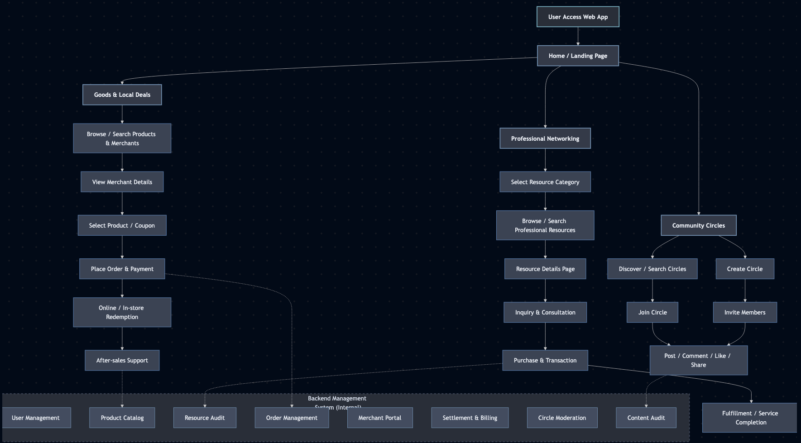
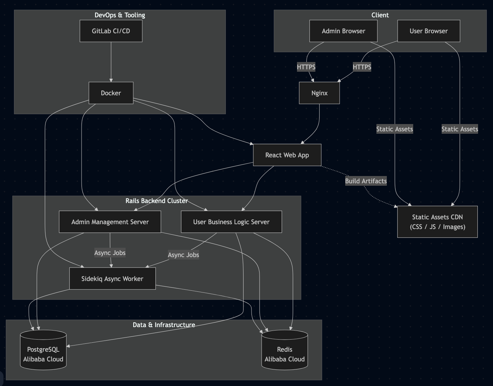

# 🌐 Hyperlocal Services Platform

**Role:** Senior Ruby Developer  
**Company:** Partner Vision InfoTech, Guangzhou, China  
**Period:** Oct 2019 – Dec 2021  

---

## 1. 📝 Project Summary

A **local life web platform** providing **exclusive products, resource monetization, and community interaction** for users in the Guangzhou area.  

**Core Business Modules:**

- **Product & Service:** Exclusive discounts, coupons for hotels, flights, gyms, restaurants, and entertainment  
- **Resource Monetization:** Platform for users to leverage valuable personal or professional connections  
- **Community:** Social circles for user interaction, content sharing, and engagement  

**Key Impact:**

- Enabled users to access **competitive local products and services**  
- Facilitated **resource monetization** and business networking  
- Built a **stable, scalable web platform** supporting fast iteration and business adjustment  

---

## 2. 🧭 User & Data Flow

**Front-end (User-facing):**

1. User logs in and selects a business module: Products, Resource Network, or Community  
2. **Product Module:** Browse products, search merchants, view details, place orders, and redeem online/offline  
3. **Resource Module:** Search resources, view details, consult, place requests/orders, handle after-sales  
4. **Community Module:** Create/join circles, post, comment, like, share, and interact with other users  

**Back-end (Admin-facing):**

- Manage users, products, resources, orders, merchants, settlements, circles, and posts  
- Admins log in to manage each module efficiently  

> **Description:** End-to-end workflow supports both user-facing interactions and admin management, ensuring smooth operations and fast business adaptation.

<!-- {: style="width:300%; display:block; margin:auto;" } -->
<!-- [{: style="width:200%; display:block; margin:auto;"}](../assets/diagrams/hyperlocal-user-flow.png) -->
<!-- {: style="width:800%; display:block; margin:auto;"} -->

---

## 3. 🏗 System Architecture

**Core Components:**

- **Web App:** React frontend served via Nginx  
- **Rails Backend:** Three servers  
  - User business logic server  
  - Admin management server  
  - Sidekiq server handling all asynchronous tasks  
- **Database:** Alibaba Cloud PostgreSQL for persistent storage  
- **Cache:** Alibaba Cloud Redis for caching and locking  
- **DevOps & Tools:** Docker, GitLab CI/CD, Nginx, Redis  

**Highlights:**

- Modular separation of **user, admin, and async tasks** ensures scalability and maintainability  
- Async workflows allow **fast processing of orders, notifications, and background jobs**  
- Architecture supports **rapid iteration** for fast business experiments and adjustments  

---

## 4. ⚡ Technical Challenges & Solutions

| **Challenge** | **Solution** |
|---------------|--------------|
| Rapid product iteration & changing business requirements | Designed flexible modular backend, enabling fast updates without downtime |
| Handling multiple business modules (products, resources, community) | Modular Rails servers and React frontend, each module independently deployable |
| High concurrency for product orders and resource requests | Redis caching and Sidekiq-based asynchronous processing to ensure reliability |
| Ensuring system stability during fast deployment | Dockerized servers and CI/CD pipelines for consistent, stable releases |

---

## 5. 👨‍💻 My Responsibilities & Achievements

- **Full lifecycle development:** Responsible for all three core business modules and admin backend  
- **Requirements gathering & integration:** Collected, reviewed, and consolidated large volumes of third-party business requirements  
- **Communication & coordination:** Worked closely with stakeholders and vendors to ensure smooth system integration  
- **Architecture & implementation:** Designed backend architecture, database schema, async workflows, and frontend modules  
- **Deployment & stability:** Managed deployment, monitoring, and fast iterations to enable business experiments  
- **Key Strengths Highlighted:** Independent development, cross-team coordination, rapid prototyping, and end-to-end system delivery  
- **Outcome:** Delivered a **stable, fully functional local life platform** that allowed the business to scale quickly, adjust products and services, and reduce operational costs  

---
