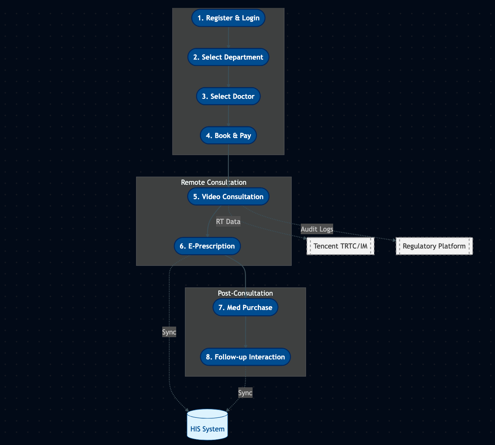
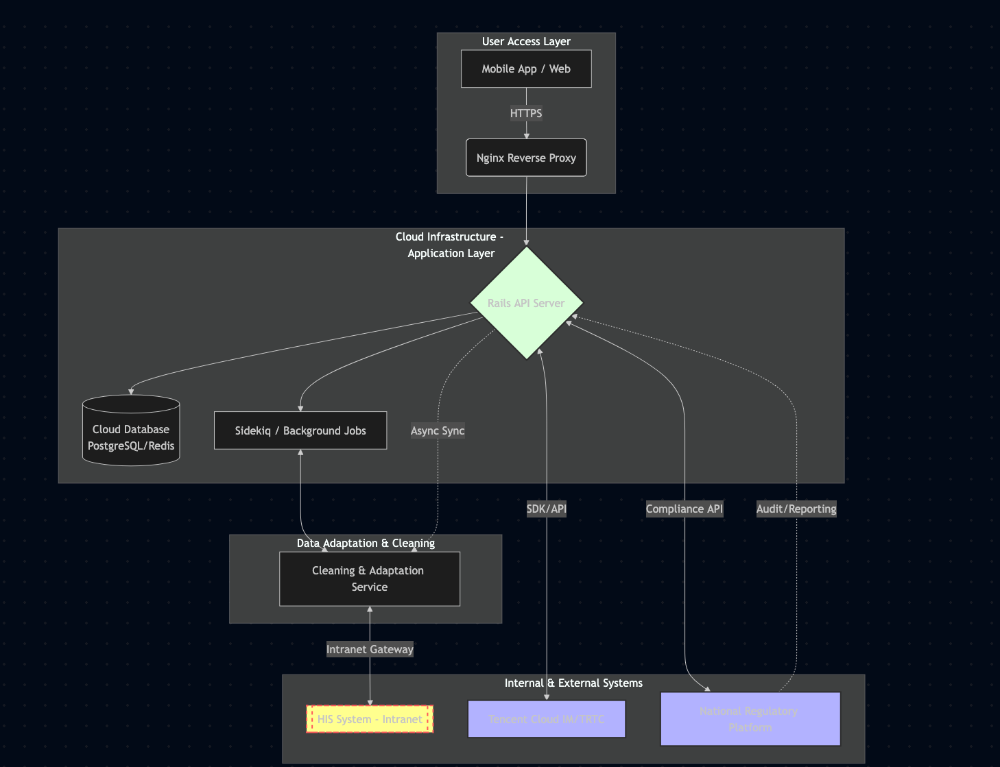

# 🏥 Online Hospital Platform (Internet Hospital)

**Role:** Senior Ruby on Rails Engineer   
**Company:** Beikang Yizhong Medical Technology, Guangdong, China  
**Period:** Dec 2021 – Nov 2022  

---

## 1. 📝 Project Summary

A **cloud-based telemedicine platform** enabling:

- Online patient registration & login  
- Appointment booking & payment  
- Real-time video consultation  
- Electronic prescriptions & medication purchasing  

Integrated with **hospital systems (HIS)** and **regulatory platforms** under strict healthcare compliance.

### Key Impact

- ✅ **Reduced hospital overcrowding** & patient waiting times  
- ✅ **Enabled remote consultations** for patients at scale  
- ✅ Built a **scalable, compliant architecture** ready for future expansion  

---

## 2. 🧭 User & Data Flow

**Description:** End-to-end patient journey from registration to follow-up, with external integration for HIS synchronization and regulatory compliance.

  

---

## 3. 🏗 System Architecture

**Core Components:**

- **Web Application:** React frontend + Rails API backend  
- **Data Adaptation Service:** Syncs & normalizes HIS data  
- **Compliance Service:** Chat archiving & regulatory reporting  

**Highlights:**  

- 🔹 Async, decoupled architecture ensures system stability despite HIS intranet isolation  
- 🔹 Modular design allows scalability & easy maintenance  

  

---

## 4. ⚡ Technical Challenges & Solutions

| **Challenge** | **Solution** |
|---------------|--------------|
| HIS system isolation | Async adaptation layer with fully decoupled integration |
| Data model mismatch | Data normalization & versioned synchronization strategies |
| Regulatory compliance | Centralized audit and automated reporting workflows |

---

## 5. 👨‍💻 My Responsibilities & Achievements

- Led **backend architecture & core module development**, driving the project from **concept to production**  
- Independently **gathered, reviewed, and consolidated extensive third-party documentation and requirements**  
- Coordinated and communicated with **hospitals and external vendors**, both on-site and remotely, ensuring smooth integration  
- Designed **HIS integration & asynchronous data pipelines** for isolated intranet systems  
- Implemented **Sidekiq-based asynchronous workflows** for reliable background processing  
- Contributed to **React frontend modules**, ensuring a seamless end-to-end user experience  
- Delivered a **stable, compliant system** actively used in real hospital environments  
- Demonstrated **full ownership**, managing both technical execution and cross-party communication effectively  
- **Key Strengths Highlighted:** Independent development, cross-team coordination, technical leadership, and end-to-end project delivery  

---
