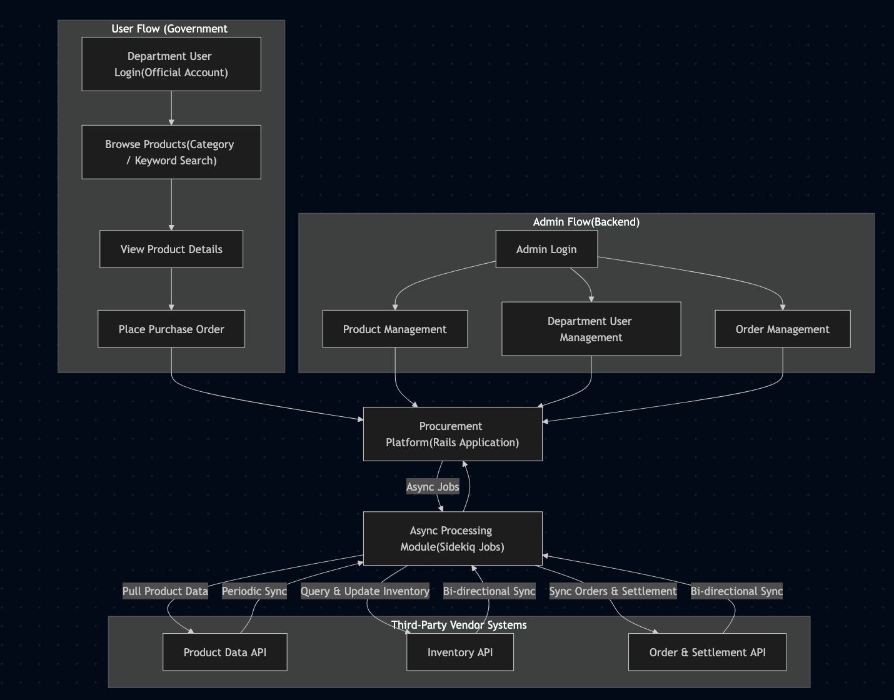
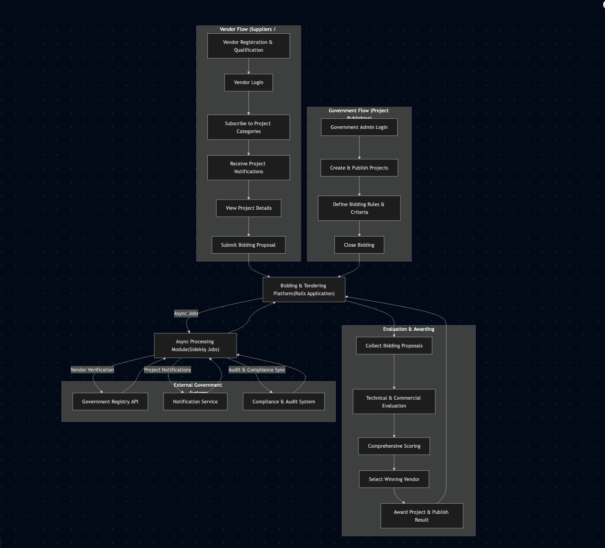
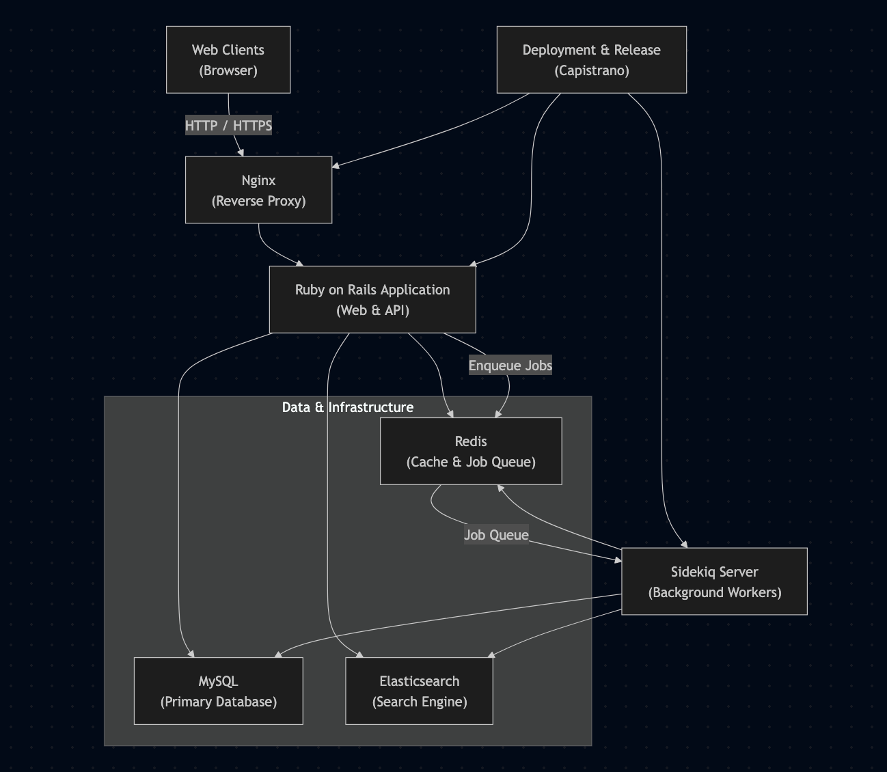

# Government Procurement & Bidding Platform

**Role:** Senior Software Engineer  
**Company:** China Beijing Sunshine Procurement  
**Period:** Oct 2018 – Oct 2019  
**Domain:** Government Procurement / Public Tendering  

---

## 1. Project Summary

The Government Procurement & Bidding Platform was a large-scale public-sector system designed to support **government purchasing and competitive tendering workflows**.

The platform consisted of two major systems:
- A **Government Procurement Platform** for standardized goods purchasing
- A **Bidding & Tendering Platform** for public project announcements and supplier competition

The system served government departments, suppliers, and enterprises, aiming to improve **procurement efficiency, transparency, and regulatory compliance** through digitalized workflows.

---

## 2. User & Data Flow

### 2.1 Procurement Platform Flow

**User Flow (Government Departments):**
1. Department users log in using official accounts
2. Browse products by category or search by keywords
3. View product details
4. Place purchase orders directly through the platform

**Admin Flow (Backend Management):**
1. Administrators log into the management system
2. Manage:
   - Products
   - Department users
   - Orders
3. All management modules integrate with **third-party vendor APIs** to ensure:
   - Product data synchronization
   - Inventory query and updates
   - Order status synchronization
   - Financial settlement updates

**Data Flow:**
- Product and inventory data are periodically pulled from third-party vendor systems
- Order and settlement data are synchronized bi-directionally
- All heavy integrations and external API interactions are processed asynchronously

 

---

### 2.2 Bidding & Tendering Platform Flow

1. Government agencies periodically publish procurement projects
2. Suppliers and enterprises register and undergo qualification review
3. Approved suppliers subscribe to relevant project categories
4. When new projects are published:
   - Eligible suppliers receive notifications
5. Suppliers decide whether to participate in bidding
6. Multiple suppliers compete for the same project
7. Final selection is made based on **comprehensive evaluation criteria**, such as:
   - Pricing
   - Qualifications
   - Compliance requirements

The platform integrates with **multiple third-party government systems** to synchronize bidding and project data.

 

---

## 3. System Architecture

### Core Architecture
- **Web Server:** Nginx (Reverse Proxy)
- **Backend:** Ruby on Rails
- **Database:** MySQL
- **Cache & Queue:** Redis
- **Async Processing:** Sidekiq
- **Search Engine:** Elasticsearch
- **Deployment:** Capistrano

### Architecture Flow
 

### Key Characteristics
- A dedicated Sidekiq server handled all asynchronous tasks
- Redis was used for both caching and background job queues
- External system integrations were isolated into background workers
- Elasticsearch supported advanced search requirements

---

## 4. Technical Challenges & Solutions

### Challenge 1: Highly Coupled Legacy Codebase (Bidding Platform)
- Business logic was scattered across controllers, models, and views
- Poor separation of concerns caused changes in one module to affect others
- ERB views contained complex business logic

**Solution:**
- Refactored the codebase following Rails conventions
- Introduced:
  - Service Objects
  - Concerns
  - Helpers
- Clearly defined responsibility boundaries
- Simplified controllers and views to follow single responsibility principles

---

### Challenge 2: Heavy Third-Party System Integrations
- Frequent API calls to external vendor and government systems
- High risk of latency and instability impacting user-facing requests

**Solution:**
- Isolated all third-party integrations into asynchronous background jobs
- Used Sidekiq to handle:
  - Product ingestion
  - Inventory synchronization
  - Order updates
  - Financial settlement synchronization
- Improved system stability and user experience

---

### Challenge 3: Database Performance Bottlenecks
- Slow queries under high data volume
- Missing or inefficient indexes

**Solution:**
- Identified and optimized slow SQL queries
- Added and refined database indexes
- Reduced response time and improved overall system throughput

---

## 5. My Responsibilities & Achievements

- Led the **end-to-end development of the government procurement platform**
- Refactored and optimized the existing bidding platform system
- Independently analyzed and consolidated a large volume of:
  - Government requirement documents
  - Third-party vendor API specifications
- Acted as the key technical contact throughout the project lifecycle:
  - Participated in on-site discussions
  - Coordinated requirements with multiple stakeholders
- Designed and implemented:
  - Core business logic
  - Asynchronous processing architecture
  - Third-party system integrations
- Improved system maintainability, scalability, and performance
- Successfully delivered a production-grade platform used in real government procurement and tendering scenarios
